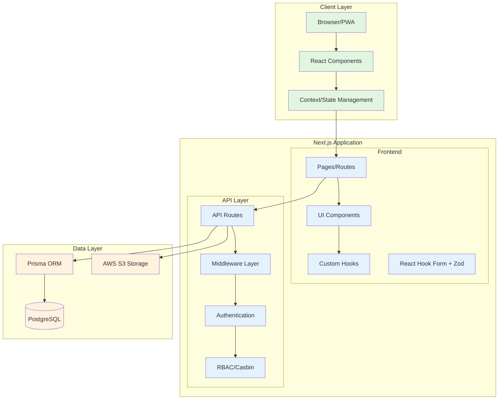
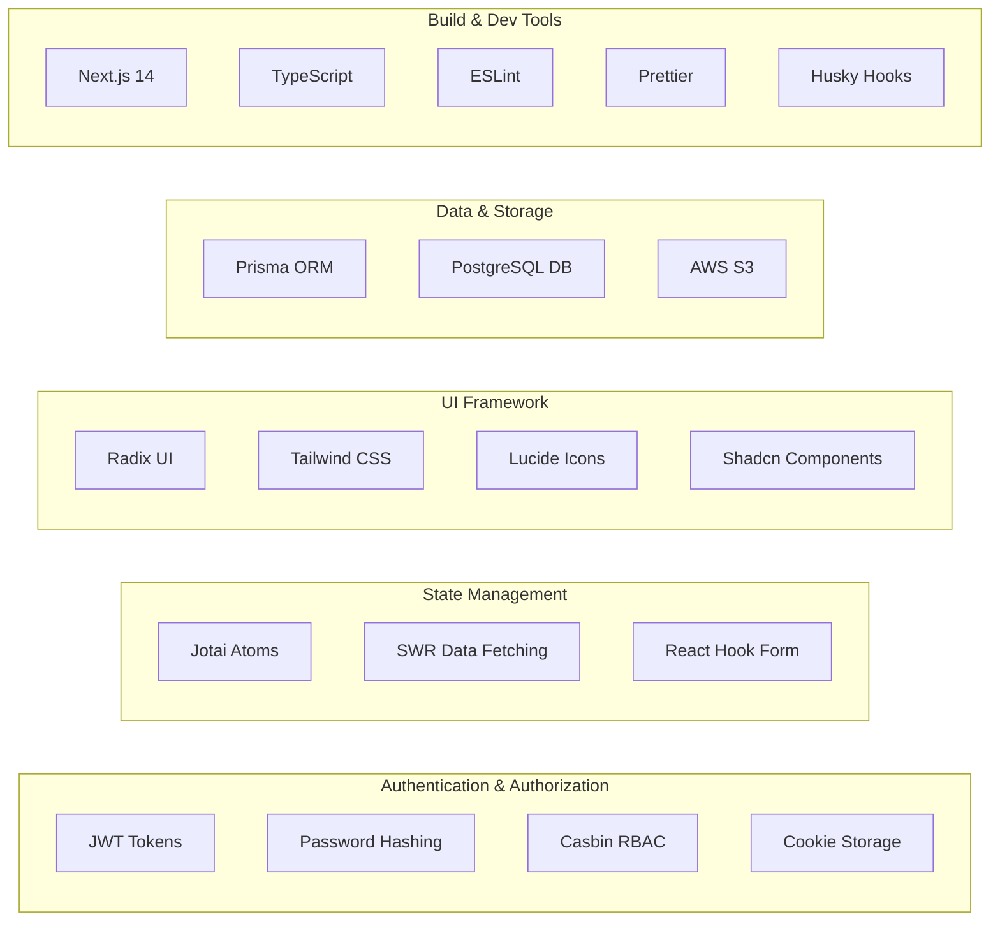
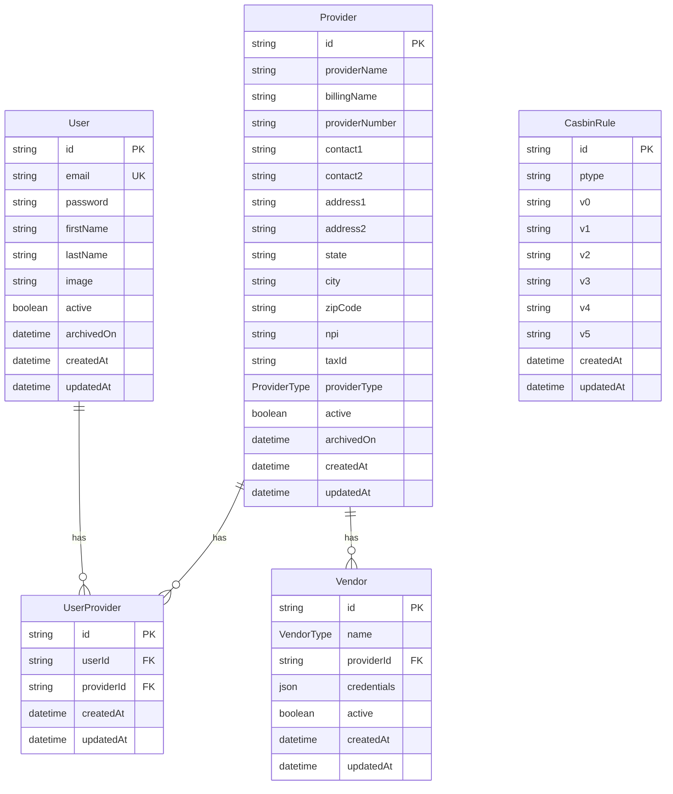
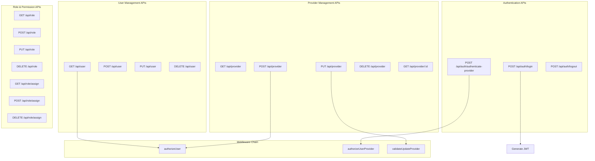
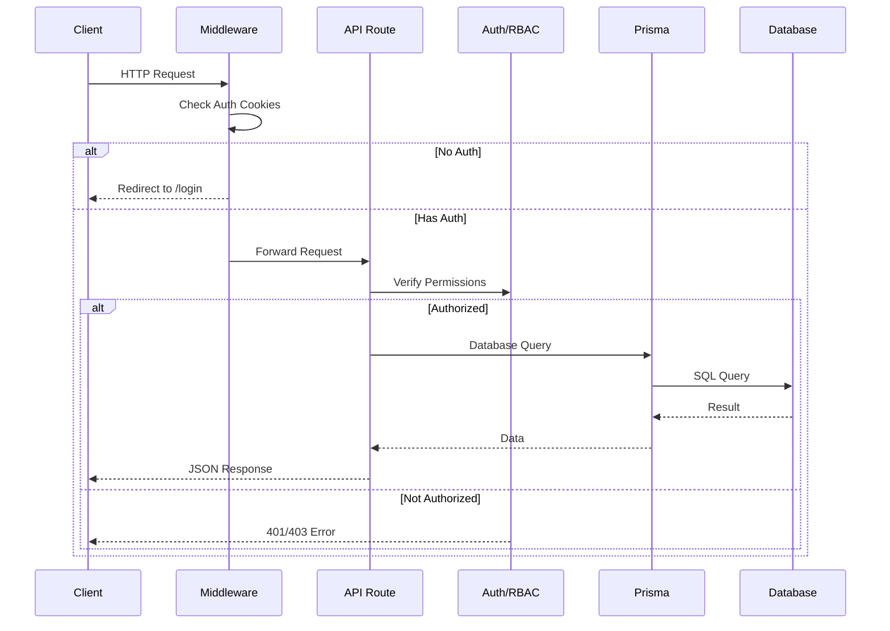
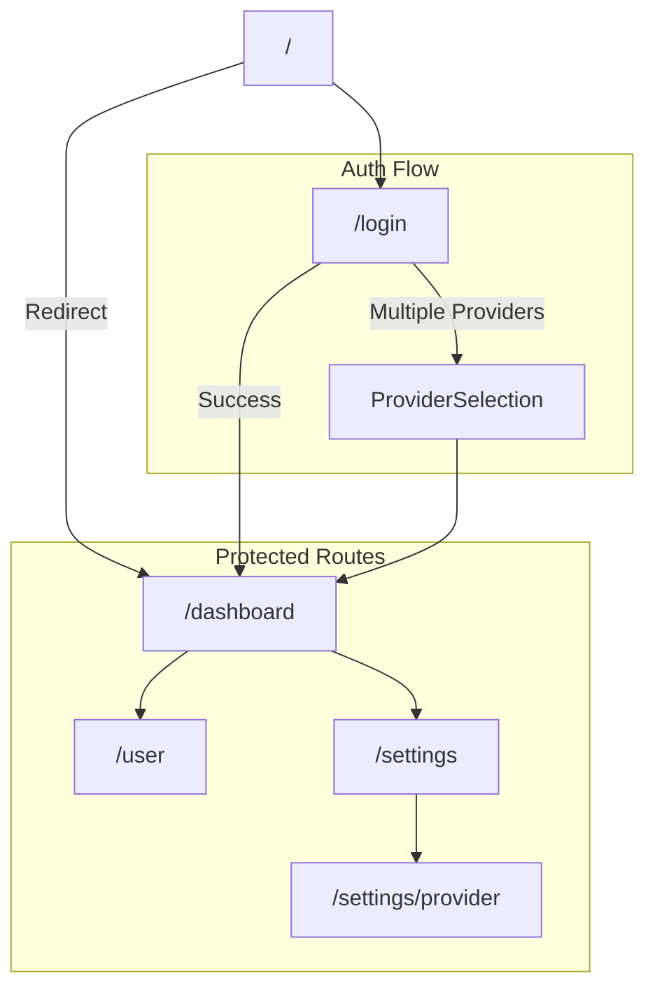

# HomeCare Application Architecture

## Architecture Overview

This is a Next.js 14 healthcare management application with the following architecture:

## Key Components

## Database Schema

## API Endpoints

## Request Flow

## Page Routes & Navigation

## Technology Stack Summary

- **Framework**: Next.js 14 (App Router)
- **Language**: TypeScript
- **Database**: PostgreSQL with Prisma ORM
- **Authentication**: JWT with cookie storage
- **Authorization**: Casbin RBAC
- **State Management**: Jotai + SWR
- **UI Components**: Radix UI + Shadcn/ui
- **Styling**: Tailwind CSS
- **Forms**: React Hook Form + Zod validation
- **File Storage**: AWS S3
- **PWA Support**: @ducanh2912/next-pwa
- **Testing**: Jest
- **Code Quality**: ESLint, Prettier, Husky
